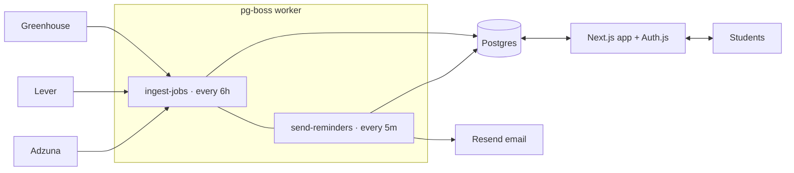

# Internbot Web

Next.js dashboard on top of the Internbot job feeds: browse new Montréal tech internships, save them, move them
through a kanban (Saved → Applied → OA → Interview → Offer/Rejected), set reminders, and see stats.



- **Ingestion** is a TypeScript port of the Python bot's sources, filters and cross-source dedupe; it reads the same
  [`companies.toml`](../companies.toml). The Python Telegram bot is unchanged.
- **Queue:** [pg-boss](https://github.com/timgit/pg-boss) on the same Postgres (no Redis). Failed ingests retry.
- **Auth:** Auth.js with Google; optional `ALLOWED_EMAIL_DOMAINS` (e.g. `live.concordia.ca`). A dev-login is available
  locally only (`AUTH_DEV_LOGIN=1`, hard-disabled when `NODE_ENV=production`).

## Run locally

```bash
cd web
cp .env.example .env          # edit AUTH_SECRET at least
docker compose up -d          # Postgres on :5433
npm install
npx prisma db push
npm run ingest                # one-off fetch (Adzuna is skipped without keys)
npm run dev                   # http://localhost:3000  (use "Dev login")
npm run worker                # in another terminal: scheduled ingest + reminder emails
```

## Tests

```bash
npm test      # unit tests (vitest): filters, normalizers, dedupe, stats, positions, email allow-list
npm run e2e   # Playwright against a separate internbot_e2e database (needs the docker Postgres up)
```

E2E covers auth redirect, search, save → board → stage moves → stats, drag-and-drop, per-user isolation, reminder
delivery (sent exactly once), and API authorization.

## Deploy

| Piece | Where | Needs |
|---|---|---|
| Postgres | Neon / Supabase free tier | `DATABASE_URL` |
| Web | Vercel, root dir `web` | `DATABASE_URL`, `AUTH_SECRET`, `AUTH_GOOGLE_ID`, `AUTH_GOOGLE_SECRET`, `ALLOWED_EMAIL_DOMAINS`, `APP_URL`, `AUTH_URL` |
| Worker | Railway / Fly using `web/Dockerfile.worker` (build context = repo root) | `DATABASE_URL`, `ADZUNA_APP_ID`, `ADZUNA_APP_KEY`, `RESEND_API_KEY`, `REMINDER_FROM`, `APP_URL` |

Google OAuth redirect URI: `https://<your-domain>/api/auth/callback/google`. Run `npx prisma db push` once against
the production database (the worker image also does this on boot).
